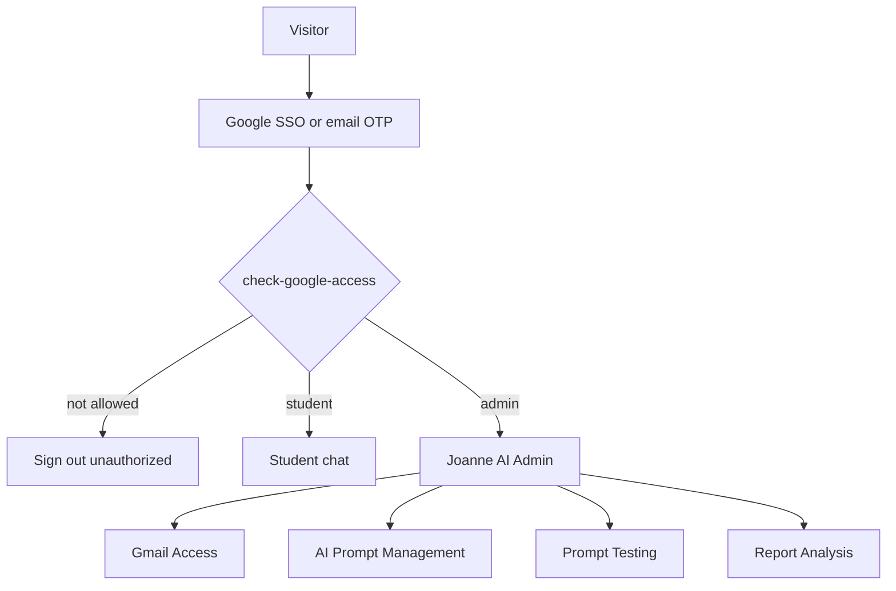

# Coach Joanne AI Marketer — functional requirements and specifications

**Product:** [https://ai.coachjoannek.com/](https://ai.coachjoannek.com/)  
**Type:** Durable specification (behaviours and APIs). No live emails and no full prompt bodies.  
**Companion dump:** [LIVE_DUMP.md](LIVE_DUMP.md)  
**UI layout (reuse this design):** [UI_LAYOUT.md](UI_LAYOUT.md)  
**Related:** [TOKEN_USAGE_ROOT_CAUSE.md](TOKEN_USAGE_ROOT_CAUSE.md)  
**Source:** Production UI/API analysis (September 2026).

This document describes **how the system is supposed to work**. Live lists, models, and module text belong in the dump file.

---

## 1. Product context

Coach Joanne AI Marketer is a gated SPA for authorized Google accounts. Students use AI marketers (Kael) to produce high-ROAS copy, single-image briefs, and lead-nurture content. Admins manage access, system prompts, sandbox tests, and usage reports.

Stack (client-visible):

- Front End: React.js
- Backend: Node.js
- Hosting behind Cloudflare
- **Supabase Auth** (Google OAuth + email OTP; OTP must not create new users)
- **Supabase** database, storage, and Edge Functions
- Optional **GoHighLevel (GHL)** location binding
- LLMs via `generate-ai-response` (student) and `test-system-prompt` (admin sandbox)

### 1.1 Actors

| Actor | Access |
| --- | --- |
| Unauthenticated visitor | Landing chat UI; cannot send until login |
| Student | Chatbots allowed by whitelist; no Joanne AI Admin |
| Admin | Student chat plus Gmail Access, AI Prompt, Prompt Testing, Report Analysis |
| Unauthorized Google account | Sign-in rejected (`unauthorizedGoogle`) |

### 1.2 Authentication

- **Continue with Google** → Google account chooser → Coach Joanne K. AI
- **Email login:** existing account only (`signInWithOtp`, `shouldCreateUser: false`) → 6-digit code → `verifyOtp`
- Session is a Supabase JWT (about 1 hour). Admin UI also verifies via `check-google-access`
- Logout: local/global sign-out

UI language (English / Chinese) is **conversation language**. Ad copy language follows the **target market** (may differ).

---

## 2. Student chat

### 2.1 Chatbots

Four modular bots (display names depend on locale):

| Key | Typical names |
| --- | --- |
| `ai_chatbot` | 高 ROAS 广告 - 文案 / High ROAS Ad Copy |
| `image_chatbot` | 高 ROAS 广告 - 单图 / High ROAS Single Image Ad |
| `lead_nurture_chatbot` | 高效率养 Leads - 内容 / High Efficiency Follow Up |
| `lead_nurture_image_chatbot` | 高效率养 Leads - 单图 |

Each bot has a configured **LLM** and **prompt modules**. Availability may be `available` or `coming_soon`.

### 2.2 Conversation lifecycle

1. `create-conversation` with `location_id`, `chatbot_key`, `prompt_locale`
2. Opening generation often uses mode **`initial`** (welcome) before or without a user message
3. User turns call **`generate-ai-response`** with `conversation_id`, latest content, **full `messages` history**, optional voice/attachments/testimonial video id, `respond_async: true`
4. Client polls the same function (`async_action: status` / retry on 429/5xx)
5. Extra modes: `handoff_resume`; recover pending jobs
6. User may rename title (max 60 characters), delete chat, change status, switch bot where allowed

Storage (client): `conversations`, `messages`; buckets for avatars, voice, attachments, generated images, testimonial video.

### 2.3 Stage model (not keyword matching)

The conversation has a **saved stage**. Modules for that stage are **compiled** and sent to the LLM with history. The student message does **not** select a module by keyword.

Copy-bot stages (example): `welcome` (initial) → `discovery` → `draft` → `completion` → `revision` / `image_handoff`.

Advance when the **workflow gate** is met (welcome done; Discovery facts collected; draft shown; user chooses A/B/C/D), not when a sentence merely “sounds like” a stage.

### 2.4 Copy-bot workflow (requirements)

- **Welcome:** identity (Kael), bot name, ask for market insight / voice, breathing-space formatting
- **Discovery:** seven questions in order; one question per turn; challenge vague audiences; website/PDF preferred over FB/IG; no invented data
- **Draft:** ADDA (Attention, Demand, Description, Action); Hidden Review internal rewrite; formatting (short paragraphs, `.` separators)
- **Completion:** A/B/C/D options, CW numbering
- **Image handoff:** MVZ headlines then a ChatGPT image prompt for the student’s own ChatGPT (not transfer to the image bot unless product says so)

Lead-nurture and image bots use their own module sets (intake, education, design rules, etc.) with the same compile + generate pattern.

### 2.5 Other student features

- Voice record/transcribe
- Reference file upload (size/count limits)
- Testimonial MP4 upload and `analyze-testimonial-video`
- Ad image generation jobs (daily/rate limits; three 800×800 variants)
- Privacy Policy and Terms of Service

---

## 3. Gmail Access

**Admin only.** Function: `manage-google-whitelist`.

| Action | Behaviour |
| --- | --- |
| `list` | All whitelist users: email, `is_admin`, `is_active`, timestamps |
| `upsert` | Add/enable; role student or admin |
| `delete` | Remove one email |
| Batch delete | Parallel deletes; cannot delete the signed-in admin’s own row |

UI: search, split **Admin Accounts** vs **Student Accounts**, add Google email, DELETE / DELETE SELECTED.

**Requirement:** only listed emails may use the app after Google/OTP login.

---

## 4. AI Prompt Management

**Admin only.** Function: `manage-system-prompt`.

Edits **instruction packs** (modules) and bot metadata. Changes apply to future compiles after **Save Current Module** / **Save Bot Info**. Draft in the editor is not live until save.

### 4.1 Actions

| Action | Purpose |
| --- | --- |
| `list` | Chatbots (key, name, model, `prompt_mode` modular) |
| `get` | One chatbot prompt metadata |
| `models` | Allowed LLM picker values |
| `modules` | Modules for `chatbot_key` + `prompt_locale` including `content` |
| `stages` | Stage keys/order/`is_initial` |
| `compiled_preview` | Combined prompt for a stage |
| `module_history` | Version list |
| `update_module` | Save module body |
| `update_metadata` | Name + model |

Locales: **`zh-MY`**, **`en-MY`**.

### 4.2 Module types (copy bot)

| Type | Role |
| --- | --- |
| `core` | Identity and highest principles |
| `stage` | Welcome, Discovery, ADDA pieces, completion |
| `output` | Formatting; Hidden Review (not shown to student) |
| `handoff` | Image/ChatGPT prompt rules |

**Requirement:** the LLM generates a **new reply** that follows compiled modules. It must not display the admin markdown as a canned “matched module” message.

---

## 5. Prompt Testing

**Admin only.** Function: `test-system-prompt`.

Sandbox against a chatbot/locale, optional **test-only model**, optional **unsaved module draft**. New test chat, send messages, greeting generation, **AI Improve** with feedback to suggest prompt text, apply to draft.

**Requirement:** testing must not be treated as a stored archive of student conversations. There is no dump of historical test threads in this spec.

Typical body: `action: test`, `chatbot_key`, `model`, `prompt_locale`, `module_key`, `module_content`, `messages`.

---

## 6. Report Analysis

**Admin only.** Function: `admin-report-analysis`.

| Action | Purpose |
| --- | --- |
| `summary` | Date range + optional `chatbot_key` (null = all) |
| `conversation_detail` | One conversation including messages and per-turn token meters |

Default UI range: **last 30 days**.

Summary payload (specified fields):

- Overview: conversations, unique users, messages, active conversations, average insight score, tracked AI responses, **input_tokens**, **output_tokens**, average response ms, identity guard hits
- Stage / status distributions
- Gmail activity (email, conversation/message counts, last active)
- Chatbot performance (model, prompt version, tokens)
- Recent conversations (capped, typically 20)
- `data_notes`: runtime metrics start, partial flag, conversation/message limit flags

**Known reporting caveats (specify as defects, not desired behaviour):**

- Total messages may cap at 1,000
- Recent rows may show `message_count: 0` despite messages
- Many rows tagged `stage: insight` / `status: active` may not match compile stages

---

## 7. Token usage (cross-cutting requirement)

Student generation sends **compiled stage prompt + full history** each turn. That drives high input tokens. Mitigations are specified in [TOKEN_USAGE_ROOT_CAUSE.md](TOKEN_USAGE_ROOT_CAUSE.md). This FR/FS does not change that architecture; it records it as current behaviour.

---

## 8. API inventory

| Function | Used by |
| --- | --- |
| `check-google-access` | Post-login authorization |
| `manage-google-whitelist` | Gmail Access |
| `manage-system-prompt` | AI Prompt Management |
| `test-system-prompt` | Prompt Testing |
| `admin-report-analysis` | Report Analysis |
| `create-conversation` | Student chat |
| `generate-ai-response` | Student chat |
| `rename-conversation` | Chat list |
| `update-conversation-status` | Status |
| `analyze-testimonial-video` | Testimonial flow |

All admin/student mutating calls require `Authorization: Bearer <access_token>`. Some functions require browser `Origin: https://ai.coachjoannek.com`.

---

## 9. Non-goals of this document

- Live Gmail lists, report numbers, or module bodies (see [LIVE_DUMP.md](LIVE_DUMP.md))
- Rebuild of the chatbot
- Implementation of token optimizations
